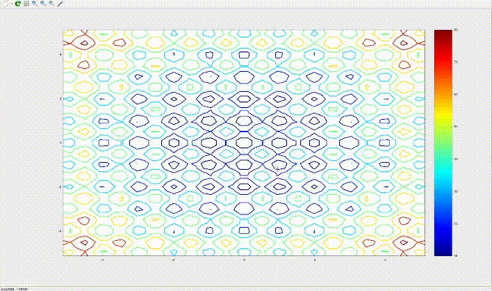
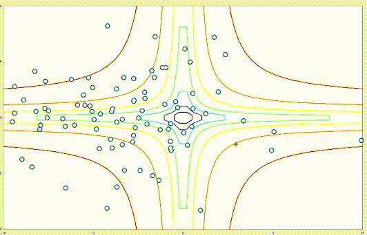
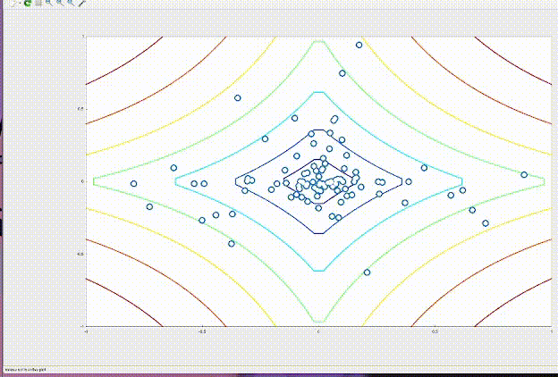
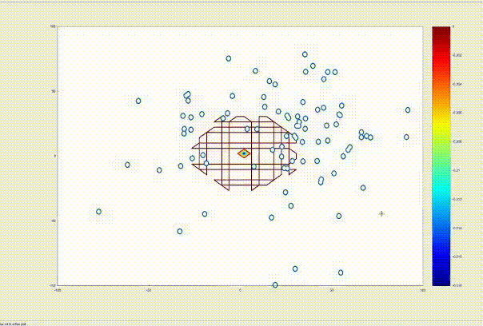
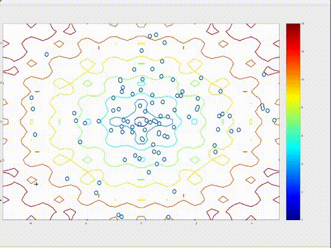
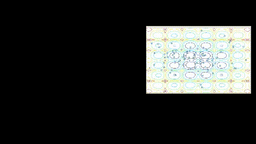

# Grey Wolf Optimizer (C++)
Grey Wolf Optimizer algorithm written on c++. Supporting 3D fitness functions on 2d graph.

## Currenty implemented and tested fitness functions
1.Rastring function
$$f(X) = An + \sum_{i=1}^{n} (x_i^2 - A \cos(2\pi x_i))$$

  

2.Hyperbolic function
$$I_i(x - c_i) = -\frac{1}{b_i \sum_{j=1}^{m} a_{ij} |x_j - c_{ij}|^{p_{ij}} + d_i}$$

                                                                                        
                                

                                                                                                      

3.Exponential function
$$I_i(x - c_i) = -d_i e^{-b_i \sum_{j=1}^{m} a_{ij} |x_j - c_{ij}|^{p_{ij}}}$$

                                                                              
                    

                                                                                            

4.Izoma function
$$f(x, y) = -\cos(x) \cos(y) e^{-(x-\pi)^2 - (y-\pi)^2}$$

                                                                                             
                                

                                                                                                           

5.Ackley function
$$f(x, y) = -20 e^{-0.2 \sqrt{0.5(x^2 + y^2)}} - e^{0.5(\cos 2\pi x + \cos 2\pi y)} + e + 20$$

                                                                         
                  

                                                                                       

6.Cross in tray function
$$f(x, y) = -0.0001 \left( \left| \sin x \sin y e^{\left| 100 - \frac{\sqrt{x^2 + y^2}}{\pi} \right|} \right| + 1 \right)^{0.1}$$

                                                                       
               

                                                                                     

7.Eggholder function 
$$f(x, y) = -(y + 47) \sin \sqrt{\left| \frac{x}{2} + y + 47 \right|} - x \sin \sqrt{|x - (y + 47)|}$$

                                                                             
                

                                                                                           

8.HolderTable function
9.Schaffer1 function
10.Schaffer2 function

